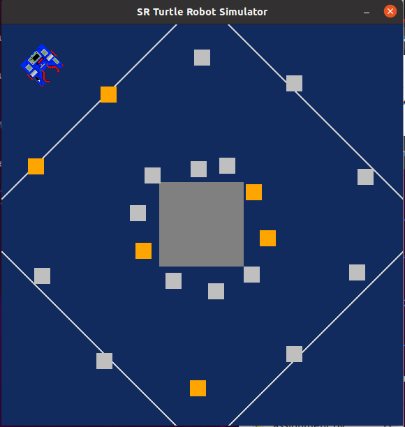
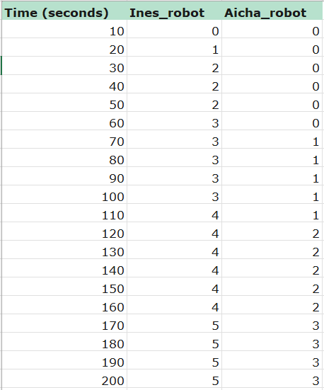
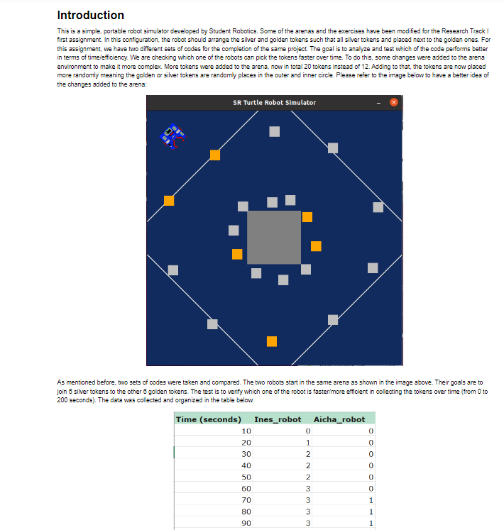

T-TEST on Python Robotics Simulator
================================

This is a simple, portable robot simulator developed by Student Robotics. Some of the arenas and the exercises have been modified for the Research Track I first assignment. In this configuration, the robot should arrange the silver and golden tokens such that all silver tokens and placed next to the golden ones. For this assignment, we have two different sets of codes for the completion of the same project. The goal is to analyze and test which of the code performs better in terms of time/efficiency. We are checking which one of the robots can pick the tokens faster over time. To do this, some changes were added to the arena environment to make it more complex. More tokens were added to the arena, now in total 20 tokens instead of 12. Adding to that, the tokens are now placed more randomly meaning the golden or silver tokens are randomly places in the outer and inner circle. Please refer to the image below to have a better idea of the changes added to the arena:



As mentioned before, two sets of codes were taken and compared. The two robots start in the same arena as shown in the image above. Their goals are to join 6 silver tokens to the other 6 golden tokens. The test is to verify which one of the robot is faster/more efficient in collecting the tokens over time (from 0 to 200 seconds). The data was collected and organized in the table below.



**Click on "T-Test.ipynb" to open the jupyternotebook and review the complete analysis and T-test, then run all cells to obtain the page below**



It is also possible to test the versions of the code, you can do this by running the following: 

```bash
$ python2 run.py IH_assignment.py
```
OR

```bash
$ python2 run.py Aicha_assignment.py
```
